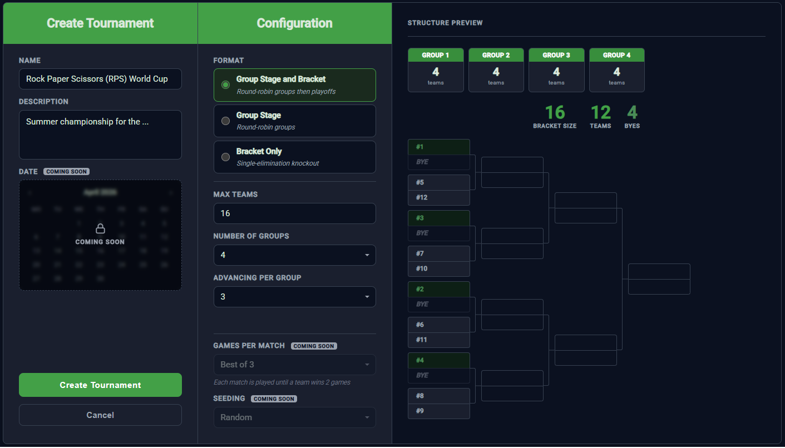

# TO2 — Tournament Organizer

Full-stack tournament management application supporting group stages, single-elimination brackets, and combined formats for 4–32 teams. Real-time updates, multi-tenant isolation, JWT authentication.

**.NET 8 Web API · Angular 17 · PostgreSQL · SignalR · xUnit · FluentAssertions**

---



## Tournament Formats

All formats accept 4–32 teams with best-of-3 series per phase.

- **BracketOnly** — Single-elimination bracket. Teams randomly seeded.
- **GroupsOnly** — Round-robin groups. Final placements from group standings.
- **GroupsAndBracket** — Round-robin groups into a seeded bracket. Configurable advancement slots per group. Unequal group sizes supported.

## Architecture


## Tournament State Machine


## Request Lifecycle — Scoring a Game


## Technical Decisions

**Pipeline pattern.** Scoring a game can cascade into match completion, standing updates, state transitions, and placement calculation. `GameResultPipeline` breaks this into 7 sequential steps with a shared context that short-circuits on failure.

**State machine in the domain layer.** Tournament lifecycle rules are enforced by `TournamentStateMachine` with explicit transition dictionaries and format-specific overloads. Every state change goes through `ValidateTransition()` — no scattered guard clauses.

**EF Core interceptors.** Tenant isolation and audit timestamps are handled by `SaveChangesInterceptor` implementations, not a base entity class. No entity needs to inherit from anything or remember to set fields manually.

**BYE system.** Brackets accept non-power-of-two team counts by padding to the next power of two and auto-resolving BYE matches. An organizer can run 11 teams through 3 groups and advance 6 into an 8-slot bracket without workarounds.

**Single SaveChanges per request.** The pipeline mutates entities in memory across multiple steps; `UnitOfWork` commits once at the end. If any step fails, nothing is persisted.

**Optimistic concurrency.** Core entities carry `[Timestamp]` RowVersion columns. In concurrent scoring scenarios, the first write wins — the second gets a concurrency exception rather than silently overwriting.

## Running Locally

**Prerequisites:** .NET 8 SDK, Node.js 18+, Docker

```bash
# Start PostgreSQL
cd src/webAPI
docker compose up -d

# Backend
dotnet restore
cd ../Infrastructure
dotnet ef database update --startup-project ../webAPI
cd ../webAPI
dotnet run

# Frontend (separate terminal)
cd src/UI
npm install
ng serve
```

Backend: `https://localhost:7268` — Frontend: `https://127.0.0.1:4200`
